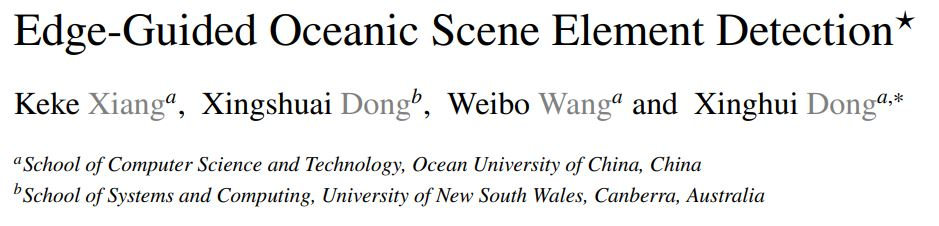
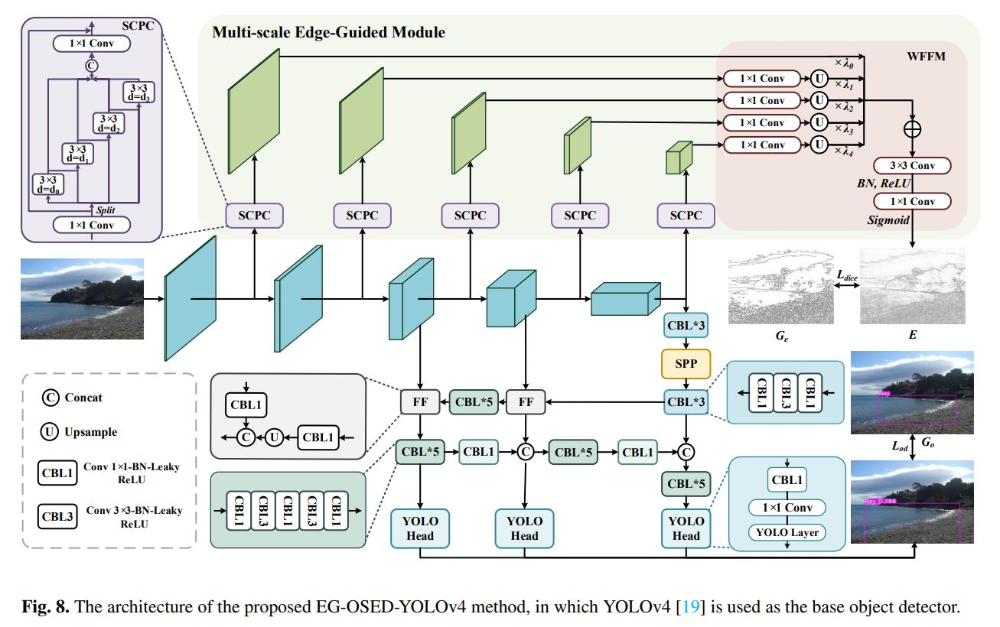
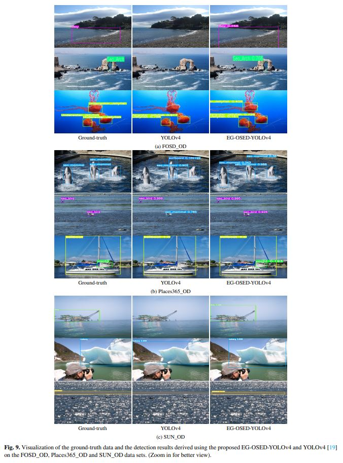

<p align="center"> <a href="" ></a></p>
<p align="center"> 
<a href="" ></a>
<a href="" ></a>
<a href="" ></a>
<!-- <a href="" ></a> -->
<!-- <a href="" ></a> -->
<a href="" ></a>
</p>

# Architecture



# Usage
### Installation
1. Create the environment from the `environment.yml` file:   
   ```copy
   conda env create -f environment.yml
   ```     
2. Activate the new environment:  
   ```copy
   conda activate py37
   ```    
3. Verify that the new environment was installed correctly:  
    ```copy
   conda env list
    ```    

### Configuration
#### Train
You can use command like this:  
```copy
python train.py -g gpu_num -subdivision sub_num -name 'proj-name' -dataset 'dataset-name' -backbone 'backbone-name' -pretrained 'pretrained-weight'
```  
You can also change parameters in the train.py and then :  
```copy
python train.py
```

#### Test
Evaluates the model on the test data sets.
```copy
python test.py -g gpu_num -name 'proj-name' -dataset 'dataset-name' -w 'weights' -backbone 'backbone-name'
```
  
### Data Sets
Download data sets : https://pan.baidu.com/s/1jmkR3__ONSWmivjZj46nHw?pwd=bl3a 提取码：bl3a    

The data sets were annotated in VOC formate and can be converted into the format used in this repo by `voc.py` as:  
```copy
python voc.py
```  

# Result


# Citation
