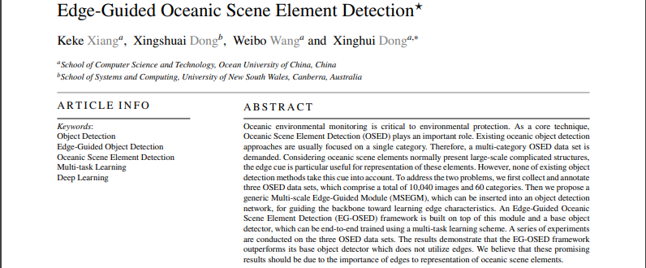

 

 

# Architecture

# Data Sets
You can download the data sets uesd in the paper from : https://pan.baidu.com/s/1WjPvBdWgK2zxbK0Z6USqJw?pwd=h04t 提取码：h04t.  

Then you can get labels file with the formate used in this repo by voc.py as:  
`python voc.py`  

# Citation
